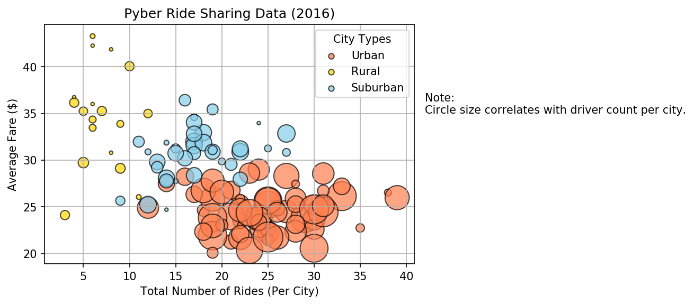

# Pyber

Summary - The Pyber aims to analyse ridesharing data to find trends and observations regarding patterns for cities and drivers. This contains information about every active driver and historic ride, including details like city, driver count, individual fares, and city type.

The first part of this project takes data for cities and drivers into a dataframe. Merges them to display Average Fare - Total Rides per city grouped by Urban, Suburban and Rural. Then displays a bubble plot that showcases the relationship between four key variables:

    * Average Fare ($) Per City
    * Total Number of Rides Per City
    * Total Number of Drivers Per City
    * City Type (Urban, Suburban, Rural)

Format: ![Pyber Ride Sharing Bubble Plot

