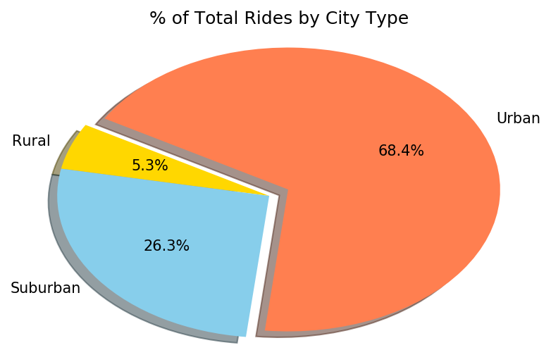

# Pyber

* Files attched 
   * Pyber Data (pyber_starter.ipynb)
   * Plots - 4 plots analysing Pyber Data generated by pyber_starter.ipynb
   * Readme file - Summarizes the project and states 3 trends observed

Summary - The Pyber aims to analyse ridesharing data to find trends and observations regarding patterns for cities and drivers. This contains information about every active driver and historic ride, including details like city, driver count, individual fares, and city type. The project uses Pandas, Matplotlib and numpy libraries and is compiled in jupyter notebook. 

**Bubble Plot of Ride Sharing Data**

The first part of this project takes data for cities and drivers into a dataframe. Merges them to display Average Fare - Total Rides per city grouped by Urban, Suburban and Rural. Then displays a bubble plot that showcases the relationship between four key variables:

    * Average Fare ($) Per City
    * Total Number of Rides Per City
    * Total Number of Drivers Per City
    * City Type (Urban, Suburban, Rural)

**Pie Charts of Fares, Rides and Drivers**

The second part focusses of creating Pie charts to give insight into the following - 

      % of Total Fares by City Type
      % of Total Rides by City Type
      % of Total Drivers by City Type

 
   
 
   
  
   

**Observable Trends**

   * There is a lot more demand in Urban areas followed by Suburban and then Rural. This is reflected in each of the charts for  Fares, Drivers and total Rides for which, the data set is dominated by City, then Suburban and then Rural.
   * There is a inverse corelation between Average Fares and total number of rides per city. The average fare is highest for Rural, then Suburban and then Urban Areas while total rides is the lowest for Rural, Suburban and then City. This explains that since there is a lot more demand in cities, and a lot more riders, the price is lower to combat compititions. It would give us more visibility if we know the distance travelled for each ride to observe if the fare is lower in cities due to shorter rides as opposed to Suburban and Rural areas.
   * There are markers for cities which have small size(indicating low number of drivers for the city). But these markers(for example x=35, y=24 approx) indicate that the cit has a high demand. Hence, Pyber needs to increase its presence in these cities to meed the expected demand.

